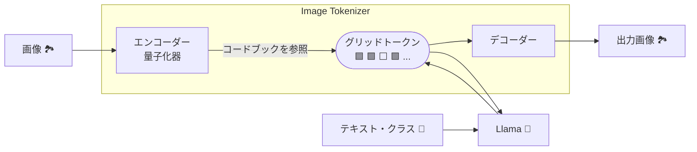

## LlamaGen: LlamaのNext-Token予測を使った画像生成

- Autoregressive Model Beats Diffusion: Llama for Scalable Image Generation
- [arXiv:2406.06525](https://arxiv.org/abs/2406.06525)

---

# はじめに

近年の画像生成AIは高品質な一方、大規模言語モデルとの統合は限定的です。ChatGPTの画像生成機能は、実際にはDALL-Eを呼び出しているに過ぎません。これは、画像生成AIと大規模言語モデルのアーキテクチャが根本的に異なることに起因します。

拡散モデルは高品質な画像を生成できますが、計算コストが高いという課題があります。一方で、自己回帰モデルは高速ですが、高解像度画像には不向きです。

**LlamaGen** は、LLMであるLlamaを自己回帰型画像生成に応用した研究です。画像をトークン化し、Llamaで予測生成することで高品質を実現します。

---
layout: image-left
image: https://cdn.bsky.app/img/avatar/plain/did:plc:et47te5fb7uv64pbltu37lcc/bafkreihfnrk5dlh43swtcstq7io6ox32z5jflucd6afirfpfm3j4zbvrnm@jpeg
---

# 自己紹介

* 名前: 小笠原寛明
* Bluesky: [@hiroga.bsky.social](https://bsky.app/profile/hiroga.bsky.social)
* Twitter: [@xhiroga](https://twitter.com/xhiroga)
* 所属: なし（2025年より社会人学生として大学院進学予定）
* 2025年3月までヒマなので、共同研究などのお誘いがあればぜひご連絡下さい！

---

# 先行研究

自己回帰モデルによる画像生成は、拡散モデル以前から存在していました。

* **PixelCNN (2016):** マスク畳み込みで自己回帰を実現
* **ImageGPT (2020):** Transformerを用いた自己回帰型画像生成。画像を低解像度化し、ピクセルをトークンとして扱う。
* **ViT (2020):** 画像をパッチに分割し、各パッチをトークンとしてTransformerエンコーダーに入力。
* **DALL-E (2021):** Transformerを用いた画像生成。VAEでトークン化。
* **VQGAN (2021):** ベクトル量子化とTransformerを用いた高解像度画像生成。
* **DiT (2023):** Transformerを用いた拡散モデル。

[^Oord_et_al_2016a]: A. van den Oord, N. Kalchbrenner, and K. Kavukcuoglu, “Pixel Recurrent Neural Networks,” Aug. 19, 2016, arXiv: arXiv:1601.06759. Accessed: Nov. 28, 2024. [Online]. Available: http://arxiv.org/abs/1601.06759
[^Oord_et_al_2016b]: A. van den Oord, N. Kalchbrenner, O. Vinyals, L. Espeholt, A. Graves, and K. Kavukcuoglu, “Conditional Image Generation with PixelCNN Decoders,” Jun. 18, 2016, arXiv: arXiv:1606.05328. doi: 10.48550/arXiv.1606.05328.
[^Chen_et_al_2020]: M. Chen et al., “Generative Pretraining from Pixels,” 2020.
[^Dosovitskiy_et_al_2020]: A. Dosovitskiy et al., “An Image is Worth 16x16 Words: Transformers for Image Recognition at Scale,” Oct. 22, 2020, arXiv: arXiv:2010.11929. doi: 10.48550/arXiv.2010.11929.
[^Ramesh_et_al_2021]: A. Ramesh et al., “Zero-Shot Text-to-Image Generation,” Feb. 26, 2021, arXiv: arXiv:2102.12092. doi: 10.48550/arXiv.2102.12092.
[^Esser_et_al_2021]: P. Esser, R. Rombach, and B. Ommer, “Taming Transformers for High-Resolution Image Synthesis,” Jun. 23, 2021, arXiv: arXiv:2012.09841. doi: 10.48550/arXiv.2012.09841.
[^Peebles_and_Xie_2023]: W. Peebles and S. Xie, “Scalable Diffusion Models with Transformers,” Mar. 02, 2023, arXiv: arXiv:2212.09748. Accessed: Nov. 07, 2024. [Online]. Available: http://arxiv.org/abs/2212.09748

---

# LlamaGenの貢献

LlamaGenの貢献は、LLMのノウハウ（アーキテクチャ、訓練手法など）を画像生成に適用し、高品質な画像生成を実現した点です。従来の自己回帰モデルでは困難だった高解像度画像生成を、LLMのスケーラビリティによって可能にしました。

---

# ソースコード

LlamaGenはオープンソースです！🎉
動かすのに苦労したので、フォークして`uv`で動くように整えたリポジトリを公開しました。💪

[FoundationVision/LlamaGen](https://github.com/FoundationVision/LlamaGen)

[xhiroga/LlamaGen](https://github.com/xhiroga/LlamaGen/tree/chore/uv)

---

# デモ

---

# 生成画像（論文の付録より）

[論文](https://arxiv.org/html/2406.06525v1)で確認します

---

# LlamaGenのアーキテクチャ

LlamaGenは、2つの主要モジュールから構成されています。

1. **Image Tokenizer:** 画像をトークン列に変換 (VQGANベース)
2. **Llama:** トークン列から自己回帰的に画像生成

---

# LlamaGen vs. ViT

どちらもTransformerを利用しますが、その役割は大きく異なります。ViTは画像認識のためのモデルですが、LlamaGenは画像生成のためのモデルです。

| 特徴 | LlamaGen | ViT |
|---|---|---|
| タスク | 画像生成 | 画像分類 |
| アーキテクチャ | Transformer Decoder | Transformer Encoder |
| トークン化対象 | 画像パッチ | 画像パッチ |
| トークン化方法 | ベクトル量子化 | パッチ埋込み |

---

# Image Tokenizer 🔎

Image Tokenizerは、高解像度画像をトークン列に変換する重要なモジュールです。Transformerの計算コストを抑える役割を担います。

* **エンコーダー:** 画像を低次元特徴マップに変換
* **量子化器:** 特徴マップをコードブック中のベクトルに置き換え (トークン化)
* **デコーダー:** トークン列から画像を再構成

---

# Image Tokenizer (VQGAN)

LlamaGenのImage Tokenizerは、VQGANのアーキテクチャをベースにしています。VQGANとほぼ同じで、自己回帰モデルにTransformerではなくLlamaを用いる点が異なります。

---
layout: image-right
image: https://www.softech.co.jp/image/mm/mm_120704_pc/image02.gif
---

# ベクトル量子化

ベクトル量子化は、連続ベクトル空間を離散コードブックで表現する手法です。VQ-VAE等で利用され、高次元データを効率的に圧縮します。

（図は『ソフテックだより』[^softech_2012]より引用）
[^softech_2012]: ソフテックだより 第１６５号（2012年7月4日発行）技術レポート「ベクトル量子化を用いた情報圧縮」https://www.softech.co.jp/mm_120704_pc.htm

---

# Image Tokenizer パラメータ

* **ダウンサンプル比:** 画像の解像度を下げる比率
  * LlamaGenの値: 8, 16
* **コードブックの語彙数:** トークンの種類
  * LlamaGenの値: 4096, 32768

256x256画像をダウンサンプル比8でトークン化 → 1024トークン

参考: Llama3のボキャブラリー(128Kトークン)

---

# Image Tokenizer 訓練における損失関数: $L_{AE}$

Image Tokenizerの訓練では、生成画像が入力画像に近づくよう、以下の損失関数を最小化します。

$L_{AE} = L_2 (x, \widehat{x}) + L_P (x, \widehat{x}) + \lambda_G L_G (\widehat{x})$

気持ちとしては、元の画像を再構成できているか？を、様々な抽象度で見比べています。

---

# 再構成損失: $L_2$

$L_2 (x, \widehat{x})$は、入力画像 $x$ と生成画像 $\widehat{x}$ の間のピクセル単位の平均二乗誤差です。これは、生成画像が元の画像をどれだけ正確に再構成できているかを測る指標となります。

---

# 知覚損失: $L_P$

$L_P (x, \widehat{x})$は、入力画像 $x$ と生成画像 $\widehat{x}$ の間の知覚的損失です。LPIPS (Learned Perceptual Image Patch Similarity)[^Zhang_et_al_2018] を使用します。LPIPSは、人間の知覚に基づいて画像の類似性を評価する指標です。

具体的には、AlexNet（画像分類モデル）の内部のべクトルの類似度で計測します。

[^Zhang_et_al_2018]: R. Zhang, P. Isola, A. A. Efros, E. Shechtman, and O. Wang, “The Unreasonable Effectiveness of Deep Features as a Perceptual Metric,” Apr. 10, 2018, arXiv: arXiv:1801.03924. doi: 10.48550/arXiv.1801.03924.

---

# 敵対的損失: $L_G$

$L_G (\widehat{x})$は、生成画像 $\widehat{x}$ に対する敵対的損失です。PatchGAN 識別器を用います。PatchGANは、画像をパッチに分割し、各パッチが本物か偽物かを識別することで、画像全体のリアルさを評価します。

---

# Next-Token予測による画像生成

Image Tokenizerで生成されたトークン列をLlamaに入力し、自己回帰的に次のトークンを予測。文章生成と同様のアプローチ。

PixelCNNやImageGPTも同様の手法ですが、LlamaGenはLLMを用いてスケーラビリティと生成品質の向上を実現しています。

---

# CFG (Classifier-Free Guidance)

LlamaGenはStable Diffusion同様、CFGを用いて条件付き画像生成を実現。

テキスト条件付けでは、T5でテキストを埋め込みに変換し、画像トークン埋め込みと連結して入力に使用。

$lg = lu + s(lc - lu)$

$lg$: 最終的なlogit、$lu$: 無条件logit、$lc$: 条件付きlogit、$s$: CFGスケール

[CFG解説記事](https://cake-by-the-river.hatenablog.jp/entry/stable_diffusion_8)

---

# Next-Token予測の訓練

大規模言語モデルの事前学習と同様。予測トークンに対する交差エントロピー誤差を計算、逆伝播。

CFGでは、条件付き損失と条件なし損失の2種類があり、それらを組み合わせて最終的な損失を計算します。

---

# 評価指標

次の評価指標のうち、特に重要なIS, FID, Precision/Recallについて詳しく述べます。

* **IS (Inception Score):** 生成画像の品質と多様性
* **FID (Fréchet Inception Distance):** 生成画像と実画像の分布の距離
* **rFID (Reconstruction FID):** Image Tokenizerの性能
* **sFID:** FIDの改良版
* **Precision/Recall:** 生成画像の多様性とプロンプト適合性
* **PSNR/SSIM:** 画質の客観的評価

---

# IS (Inception Score)[^Salimans_et_al_2016]

[^Salimans_et_al_2016]: T. Salimans, I. Goodfellow, W. Zaremba, V. Cheung, A. Radford, and X. Chen, “Improved Techniques for Training GANs,” Jun. 10, 2016, arXiv: arXiv:1606.03498. doi: 10.48550/arXiv.1606.03498.

画像のクラス分類モデルであるInceptionNetを用いて、画像生成モデルの品質を測る手法です。

評価対象の画像生成モデルでまとまった量の画像を生成し、それらの画像について次の確率分布を測ります。

1. ある画像の分類結果の分布。特定のラベルに集中しているほど良い
2. 画像全体の分類結果の分布。全てのラベルに広がっているほど良い

2つの確率分布を算出したら、それらの分布の違いを測ります。具体的には、KLD（カルバック・ライブラー・ダイバージェンス）を計算します。そして、すべての画像におけるKLDの平均を取り、そのexpを取った値がインセプションスコアとなります。

値は高いほど良く、GANで約220、潜在拡散モデルで約250、LlamaGenでは約310となっています。

---

# FID (Fréchet inception distance)[^Heusel_et_al_2017]

[^Heusel_et_al_2017]: M. Heusel, H. Ramsauer, T. Unterthiner, B. Nessler, and S. Hochreiter, “GANs Trained by a Two Time-Scale Update Rule Converge to a Local Nash Equilibrium,” Jan. 12, 2018, arXiv: arXiv:1706.08500. doi: 10.48550/arXiv.1706.08500.

日本語にするとフレチェインセプション距離でしょうか。2つの分布の違いを、中心の違いと散らばり方の違いの2つの観点から測り、足し合わせた値です。

具体的には、次の2つの項を計算します。

1. 2つの分布の平均べクトルの間の距離
2. 2つの分布の分散共分散行列の差異のトレース（詳細は計算式を参照してください）

値は小さいほど良く、BigGANで約7, 最新の評価にはDiffusionで約2となっています。

計算にあたってはベンチマーク対象が必要で、LlamaGenではImageNetでベンチマークを行っています。

---

# Precision/Recall[^Kynkaanniemi_et_al_2019]

[^Kynkaanniemi_et_al_2019]: T. Kynkäänniemi, T. Karras, S. Laine, J. Lehtinen, and T. Aila, “Improved Precision and Recall Metric for Assessing Generative Models,” Oct. 30, 2019, arXiv: arXiv:1904.06991. doi: 10.48550/arXiv.1904.06991.

適合度と再現率です。実際の画像の分布と生成した画像の分布の重なり合う範囲を比較します。

といっても、画像生成モデルに、学習データと全く同じ画像を再現させることは望めませんし、求められていません。そこで、実際の画像と生成した画像のそれぞれに似た画像がお互いに含まれているかを判断します。具体的には、画像をVGGなどでベクトル化し、特徴空間においてn番目に近い画像までの距離を半径とした超球を作り、比較対象の画像がその超球に含まれるかによって判断します。

値は高いほどよく、LlamaGenのPrecisionは約0.8、Recallは約0.5となっています。

---

# 評価

- Llamaのパラメータ数ごとのLlamaGenの画像生成のスコア
- パラメータ数が増加するとスコアも改善されることが分かり、スケール則が示唆されている

---

# もっとスケールしないのか？

- パラメータ数は次の通り...
  - B: 111M, L: 343M, XL: 775M, XXL: 1.4B, 3B
  - 1サイズごとにおよそ倍になっている
- にも関わらずスコアの改善が低調に見えるのは、学習に用いられた画像（ImageNet: 100万枚）の少なさに由来するという主張
- 参考までに、Stable Diffusionなどで学習に用いられているデータセットは[LAION-2B](https://huggingface.co/datasets/laion/relaion2B-en-research-safe)（20億枚）など

---

# 従来の画像生成モデルとの比較

- 特に注目したいモデルは次の通り
  - BigGANやVQGANなど、2021年以前のモデルには大きな差を付けて勝っている
  - LDM（潜在拡散モデル, 応用にStable Diffusionなど）にも勝っている
- 画像生成をLlamaで扱うにあたってトークンへと離散化を行っているが、それはもはやボトルネックではないという主張

---
layout: image-right
image: https://raw.githubusercontent.com/vllm-project/vllm/main/docs/source/assets/logos/vllm-logo-text-light.png
---

# vLLMの採用

自己回帰モデルは推論速度が遅いという弱点がある。しかし、本研究ではLlamaを用いることでLLMコミュニティの発展の恩恵に預かることができた。

---

# vLLMによる高速推論

- LlamaGenではvLLMを採用することで326% ~ 414%の高速化を行っている
- （特に参考にならないが、手元のRTX4090だとXLモデルで画像4枚あたり30秒ほど）

---

# まとめ

- LlamaGenはLLMを自己回帰型画像生成に応用した新しいモデル。
- 高品質なImage Tokenizerと効率的な訓練で拡散モデルに匹敵する品質を実現。
- LLMのスケール則に従うため、性能の向上が見込める。
- 単一モデルでテキスト・画像の両方を生成するためのステップと見なせる。

---

# Q&A

ご清聴ありがとうございました！
質問等あればお気軽にどうぞ！🙋‍♀️
