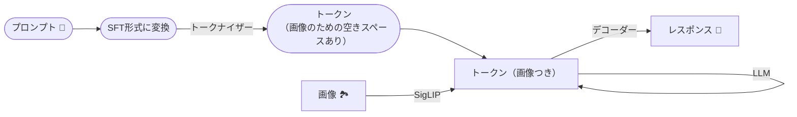
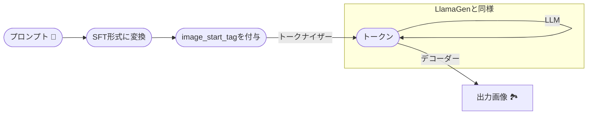

## マルチモーダル理解と生成の統合 / DeepSeek Janus, etc...

- Janus: Decoupling Visual Encoding for Unified Multimodal Understanding and Generation
- Janus-Pro: Unified Multimodal Understanding and Generation with Data and Model Scaling
- [arXiv:2410.13848](http://arxiv.org/abs/2410.13848) / [arXiv:2501.17811](https://arxiv.org/abs/2501.17811)

---

## 目次

- はじめに
- DeepSeek Janus (Pro)とは？
- モデルの概要
  - Janus (Pro)のアーキテクチャ
  - デモ
- Janusから学ぶ
  - 視覚エンコーディング分離
  - 学習戦略
- マルチモーダル理解・生成の統合
  - Chameleon, etc...
  - Janus, etc...
  - 画像トークナイザーの改良
- まとめ
- 参考文献など

---
layout: image-right
image: https://cdn.bsky.app/img/avatar/plain/did:plc:et47te5fb7uv64pbltu37lcc/bafkreihfnrk5dlh43swtcstq7io6ox32z5jflucd6afirfpfm3j4zbvrnm@jpeg
---

# はじめに: 自己紹介

- 名前: 小笠原寛明
- Twitter: [@xhiroga](https://twitter.com/xhiroga)
- Bluesky: [@hiroga.bsky.social](https://bsky.app/profile/hiroga.bsky.social)
- 興味関心: お絵描き, 3D, CG, CV, マルチモーダルモデル
- **フォロー**すると、開発や調べ物の様子が見えます！

---

# はじめに: どうしてJanusについて調べたの？

- オープンウェイトな自己回帰モデルで、最先端の画像生成に追随するモデルが遂に出てきたため。
- マルチモーダルLLMのトレンドを、この機会に整理したいと思ったため！

---

# マルチモーダル理解・生成モデルの何が嬉しいのか？

- LLMが図表ありで応答できるようになる！
- Visual Chat & Interleaved Text/Image Generationの例 (Chameleon)

---

# DeepSeek Janus (Pro)とは？

- DeepSeek-LLMを基盤モデルとして、マルチモーダル対応の学習を追加で行ったモデル。
- 2024年10月にJanus-1.3Bが公開された
- 2025年1月にJanus Pro 1B/7Bが公開された

---
layout: image-right
image: https://upload.wikimedia.org/wikipedia/commons/f/f4/Janus-Vatican.JPG
---

# トリビア: ヤーヌスとは？

ローマ神話の出入口の扉の守護神。入口の神なので、1年の始まり＝1月(January)の守護神でもある。[^Wikipedia_ヤーヌス]

[^Wikipedia_ヤーヌス]:https://ja.wikipedia.org/wiki/%E3%83%A4%E3%83%BC%E3%83%8C%E3%82%B9

---

# Janus (Pro)のアーキテクチャ（理解）

**補足**

- SFT形式: `[{'role': '<|User|>', 'content': prompt}, {'role': '<|Assistant|>', ...}]`

---

# Janus (Pro)のアーキテクチャ（生成）

次トークン予測の概要

図: M. Huang, Z. Mao, Z. Chen, and Y. Zhang, “Towards Accurate Image Coding: Improved Autoregressive Image Generation with Dynamic Vector Quantization,” May 19, 2023, arXiv: arXiv:2305.11718. doi: 10.48550/arXiv.2305.11718.

---

# Janus (Pro)のアーキテクチャ（生成）

**補足**

- image_start_tag: `<begin_of_image>`

---
layout: two-cols-header
---

## 触ってみよう！

::left::

## HuggingFace (Janus-Pro-7B)

https://huggingface.co/spaces/deepseek-ai/Janus-Pro-7B

::right::

## Google Colab

https://github.com/xhiroga/til/blob/main/software-engineering/deepseek-ai/Janus/_src/sandbox/Janus_Pro_1B.ipynb

---

# Janusから学ぶ: 視覚エンコーディングの分離

- マルチモーダル理解・生成タスクでは、それぞれ必要な理解度が異なる
  - 理解タスクでは画像の概要が掴めれば良い
  - 生成タスクではピクセルレベルの細部を知る必要がある
- Janusでは、理解と生成で別々のトークナイザーを用いている
  - SigLIP
  - LlamaGenで開発されたVQ(画像量子化)トークナイザー

---

# SigLIP

- Googleが改良したCLIP
- 画像とテキストの類似性を確率で見ることができる

引用: [日本語にも対応するマルチモーダルAIモデルSigLIPでゼロショット画像分類を試す / tsutof](https://zenn.dev/tsutof/articles/f53f035f8df9f3)

---

# LlamaGen

- LLMの次トークン予測を用いて、画像の次のパッチを予測することで画像を生成するモデル
- LlamaGenのVQトークナイザーは、格子状に分割した画像のパッチを、数千〜数万以上の分類から最も類似したコードに割り当てる（＝量子化）
- 前回の発表をご覧ください！

---
layout: two-cols-header
---

# Janusから学ぶ: 学習戦略

Janus Proは、Janusと比較して次の通り改良されている

::left::

## Janus 1.3Bの学習戦略

- Stage1: アダプター・画像ヘッド
  - 視覚エンコーダとLLMは凍結し、変換用の小さなネットワーク（アダプター・画像ヘッド）を訓練
  - 10,000ステップ
- Stage2: 事前学習
  - ImageNetを用いたカテゴリ→画像の変換、それ以外のデータセットによるテキスト→画像の変換
  - 180,000ステップ
- Stage3: 教師ありファインチューニング
  - (内容)
  - 24,000ステップ

::right::

## Janus **Pro** 1Bの学習戦略

- Stage1
  - Janusと同様
  - **20,000**ステップ
- Stage2: 事前学習
  - 単純なカテゴリ→画像の変換は避け、詳細なテキスト→画像の変換に絞って訓練
  - **360,000**ステップ
- Stage3: 教師ありファインチューニング
  - Janusと同様
  - **80,000**ステップ

---

# マルチモーダル理解・生成の統合: Chameleon, etc...

- 代表的な統合マルチモーダル理解・生成モデル
- それ以前の、LLMと拡散モデルを組み合わせたようなモデルとは異なり、単一のモデルで理解・生成を完結させる
- 理解と生成で同一の画像トークナイザーを用いる
- 「文章と画像が混ざったドキュメント」を単一モデルの一回の推論で出力することができる（例）

図: C. Team, “Chameleon: Mixed-Modal Early-Fusion Foundation Models,” May 16, 2024, arXiv: arXiv:2405.09818. doi: 10.48550/arXiv.2405.09818.

---

# マルチモーダル理解・生成の統合: Janus, etc...

- 前述の通り、視覚理解と生成で異なるトークナイザーを用いている
- 理解タスクでは画像の意味が重要だが、生成タスクでは空間の構造やテクスチャを詳細に捉えることが必要
- つまり求められる符号化の質が異なるため
- 統合されたトークナイザーよりも効率的だが、モデルが複雑になる欠点がある

---
layout: two-cols-header
---

# マルチモーダル理解・生成の統合: 画像トークナイザーの改良

単一の画像トークナイザーで、理解と生成のそれぞれに適した符号化を与える試みがある。いずれも論文を参照ください。

::left::

## TokenFlow

- 理解と生成で同一のトークナイザーを用いつつも、タスクごとに異なる特性を発揮させるアーキテクチャが提案されている
- TokenFlowは、意味的な特徴とピクセルレベルの詳細に対応した、2つのコードブックの情報を併せ持つ量子化の手法

::right::

## One-D-Piece

- TURINGが提案した画像トークナイザー
- 画像をトークナイズするために必要なトークン数を可変にできる
- パッチ画像とトークンを1:1対応させずに、潜在変数に埋め込みを集める "TiTok" と、重要な情報を先頭のトークンに集める "Tail Drop" の併せ技
- [Zennの記事](https://zenn.dev/turing_motors/articles/6d77c5a3b3712e)も参照

---

# まとめ

- マルチモーダル理解・生成モデルの改善が続いている
- DeepSeek Janusは理解・生成のトークナイザーを別々にするアプローチを取った
- 可変の画像トークナイザーが提案されつつあり、今後のマルチモーダルLLMに組み込まれることが予想される

---

# 参考文献 (1)

- C. Wu et al., “Janus: Decoupling Visual Encoding for Unified Multimodal Understanding and Generation,” Oct. 17, 2024, arXiv: arXiv:2410.13848. doi: 10.48550/arXiv.2410.13848.
- Y. Ma et al., “JanusFlow: Harmonizing Autoregression and Rectified Flow for Unified Multimodal Understanding and Generation,” Nov. 12, 2024, arXiv: arXiv:2411.07975. doi: 10.48550/arXiv.2411.07975.
- X. Chen et al., “Janus-Pro: Unified Multimodal Understanding and Generation with Data and Model Scaling,” Jan. 29, 2025, arXiv: arXiv:2501.17811. doi: 10.48550/arXiv.2501.17811.
- X. Zhai, B. Mustafa, A. Kolesnikov, and L. Beyer, “Sigmoid Loss for Language Image Pre-Training,” Sep. 27, 2023, arXiv: arXiv:2303.15343. doi: 10.48550/arXiv.2303.15343.
- P. Sun et al., “Autoregressive Model Beats Diffusion: Llama for Scalable Image Generation,” Jun. 10, 2024, arXiv: arXiv:2406.06525. doi: 10.48550/arXiv.2406.06525.

---

# 参考文献 (2)

- J. Xiong et al., “Autoregressive Models in Vision: A Survey,” Nov. 08, 2024, arXiv: arXiv:2411.05902. doi: 10.48550/arXiv.2411.05902.
- C. Team, “Chameleon: Mixed-Modal Early-Fusion Foundation Models,” May 16, 2024, arXiv: arXiv:2405.09818. doi: 10.48550/arXiv.2405.09818.
- X. Wang et al., “Emu3: Next-Token Prediction is All You Need,” Sep. 27, 2024, arXiv: arXiv:2409.18869. doi: 10.48550/arXiv.2409.18869.
- L. Qu et al., “TokenFlow: Unified Image Tokenizer for Multimodal Understanding and Generation,” Dec. 04, 2024, arXiv: arXiv:2412.03069. doi: 10.48550/arXiv.2412.03069.
- K. Miwa, K. Sasaki, H. Arai, T. Takahashi, and Y. Yamaguchi, “One-D-Piece: Image Tokenizer Meets Quality-Controllable Compression,” Jan. 17, 2025, arXiv: arXiv:2501.10064. doi: 10.48550/arXiv.2501.10064.
- [可変品質での圧縮を実現する画像トークナイザ「One-D-Piece」を公開しました](https://zenn.dev/turing_motors/articles/6d77c5a3b3712e)
