## マルチモーダル理解と生成の統一 / DeepSeek Janus, etc...

- Janus-Pro: Unified Multimodal Understanding and Generation with Data and Model Scaling
- [arXiv:2501.17811](https://arxiv.org/abs/2501.17811)

---

## 目次

- はじめに
- DeepSeek Janus (Pro)とは？
- モデルの概要
  - Janus (Pro)のアーキテクチャ（理解）
  - Janus (Pro)のアーキテクチャ（生成）
  - デモ
- Janusから学ぶ
  - 視覚エンコーディング分離
  - 学習戦略
- マルチモーダルLLMの流れ
  - Chameleon
  - Janus
  - 統一画像トークナイザー
- まとめ
- 参考文献など

---
layout: image-right
image: https://cdn.bsky.app/img/avatar/plain/did:plc:et47te5fb7uv64pbltu37lcc/bafkreihfnrk5dlh43swtcstq7io6ox32z5jflucd6afirfpfm3j4zbvrnm@jpeg
---

# はじめに: 自己紹介

- 名前: 小笠原寛明
- Twitter: [@xhiroga](https://twitter.com/xhiroga)
- Bluesky: [@hiroga.bsky.social](https://bsky.app/profile/hiroga.bsky.social)
- 興味関心: お絵描き, 3D, CG, CV, マルチモーダルモデル
- **フォロー**すると、開発や調べ物の様子が見えます！

---

# はじめに: どうしてJanusについて調べたの？

- オープンウェイトな自己回帰モデルで、最先端の画像生成に追随するモデルが遂に出てきたため。
- マルチモーダルLLMのトレンドを、この機会に整理したいと思ったため！

---

# マルチモーダル理解・生成モデルの何が嬉しいのか？

- LLMが図表ありで応答できるようになる！
- Visual Chat & Interleaved Text/Image Generationの例 (Chameleon)


---

# DeepSeek Janus (Pro)とは？

- DeepSeek-LLMを基盤モデルとして、マルチモーダル対応の学習を追加で行ったモデル。
- 2024年10月にJanus-1.3Bが公開された
- 2025年1月にJanus Pro 1B/7Bが公開された

---
layout: image-right
image: https://upload.wikimedia.org/wikipedia/commons/f/f4/Janus-Vatican.JPG
---

# トリビア: ヤーヌスとは？

ローマ神話の出入口の扉の守護神。入口の神なので、1年の始まり＝1月(January)の守護神でもある。[^Wikipedia_ヤーヌス]

[^Wikipedia_ヤーヌス]:https://ja.wikipedia.org/wiki/%E3%83%A4%E3%83%BC%E3%83%8C%E3%82%B9

---

## Janus (Pro)のアーキテクチャ（理解）

```mermaid
flowchart LR
    t([プロンプト 💬])
    i[画像 🏞️]
    t-->sft([SFT形式に変換])
    sft--トークナイザー-->token_without_image([トークン<br/>（画像のための空きスペースあり）])
    token_without_image-->token[トークン（画像つき）]
    i--SigLIP-->token
    
    token--LLM-->token
    token -- デコーダー--> res[レスポンス 💬]
```



**補足**

- SFT形式: `[{'role': '<|User|>', 'content': prompt}, {'role': '<|Assistant|>', ...}]`


---

## Janus (Pro)のアーキテクチャ（生成）

```mermaid
flowchart LR
    t([プロンプト 💬])
    t-->sft([SFT形式に変換])
    sft-->with_image_start_tag([image_start_tagを付与])
    with_image_start_tag--トークナイザー-->token([トークン])

    subgraph LlamaGenと同様
      token--LLM-->token
    end

    token -- デコーダー--> o[出力画像 🏞️]
```

**補足**

- image_start_tag: `<begin_of_image>`

---
layout: two-cols-header
---

## 触ってみよう！

::left::

## HuggingFace (Janus-Pro-7B)

https://huggingface.co/spaces/deepseek-ai/Janus-Pro-7B

::right::

## Google Colab

https://github.com/xhiroga/til/blob/main/software-engineering/deepseek-ai/Janus/_src/sandbox/Janus_Pro_1B.ipynb

---

# Janusから学ぶ: 視覚エンコーディングの分離

- マルチモーダル理解・生成タスクでは、それぞれ必要な理解度が異なる
  - 理解タスクでは画像の概要が掴めれば良い
  - 生成タスクではピクセルレベルの細部を知る必要がある
- Janusでは、理解と生成で別々のトークナイザーを用いている
  - SigLIP
  - LlamaGenで開発されたVQ(画像量子化)トークナイザー

---

# SigLIP

- Googleが改良したCLIP
- 画像とテキストの類似性を確率で見ることができる


引用: [日本語にも対応するマルチモーダルAIモデルSigLIPでゼロショット画像分類を試す / tsutof](https://zenn.dev/tsutof/articles/f53f035f8df9f3)

---

# LlamaGen

- LLMの次トークン予測を用いて、画像の次のパッチを予測することで画像を生成するモデル
- LlamaGenのVQトークナイザーは、格子状に分割した画像のパッチを、数千〜数万以上の分類から最も類似したコードに割り当てる（＝量子化）
- 前回の発表をご覧ください！


---
layout: two-cols-header
---

# Janusから学ぶ: 学習戦略

Janus Proは、Janusと比較して次の通り改良されている

::left::

## Janus 1.3Bの学習戦略

- Stage1: アダプター・画像ヘッド
  - 視覚エンコーダとLLMは凍結し、変換用の小さなネットワーク（アダプター・画像ヘッド）を訓練
  - 10,000ステップ
- Stage2: 事前学習
  - ImageNetを用いたカテゴリ→画像の変換、それ以外のデータセットによるテキスト→画像の変換
  - 180,000ステップ
- Stage3: 教師ありファインチューニング
  - (内容)
  - 24,000ステップ

::right::

## Janus **Pro** 1Bの学習戦略

- Stage1
  - Janusと同様
  - **20,000**ステップ
- Stage2: 事前学習
  - 単純なカテゴリ→画像の変換は避け、詳細なテキスト→画像の変換に絞って訓練
  - **360,000**ステップ
- Stage3: 教師ありファインチューニング
  - Janusと同様
  - **80,000**ステップ

---

# マルチモーダルLLMの流れ: Chameleon

TODO: これが前提であるということわり

- Janus以前から登場していたマルチモーダル理解・生成モデル
- 理解と生成で同一の画像トークナイザーを用いている


---

# マルチモーダルLLMの流れ: Janus

---
layout: two-cols-header
---

# マルチモーダルLLMの流れ: 統一画像トークナイザー

TODO: 統一画像トークナイザー、というのは正しい？

TODO: もうちょっと理解して書き、外部リソースに誘導

:::left:::

- 理解と生成で同一のトークナイザーを用いつつも、タスクごとに異なる特性を発揮させるアーキテクチャが提案されている
- TokenFlowは、意味的な特徴とピクセルレベルの詳細に対応した、リンクする2つのコードセットを持つトークナイザーを提案している

:::right:::

- TURINGが提案したOne-D-Pieceでは、画像の重要な情報をベクトルの先頭に集中させることで、先頭のケタを用いれば必要な解像度が得られるようにしている

---

# おすすめ記事

TODO: なぜおすすめ？

[](https://zenn.dev/turing_motors/articles/6d77c5a3b3712e)

---

# まとめ

- マルチモーダル理解・生成モデルの改善が続いている
- DeepSeek Janusは理解・生成のトークナイザーを別々にするアプローチを取った
- 可変の画像トークナイザーが提案されつつあり、今後のマルチモーダルLLMに組み込まれることが予想される

---

# 参考文献 (1)

- C. Wu et al., “Janus: Decoupling Visual Encoding for Unified Multimodal Understanding and Generation,” Oct. 17, 2024, arXiv: arXiv:2410.13848. doi: 10.48550/arXiv.2410.13848.
- Y. Ma et al., “JanusFlow: Harmonizing Autoregression and Rectified Flow for Unified Multimodal Understanding and Generation,” Nov. 12, 2024, arXiv: arXiv:2411.07975. doi: 10.48550/arXiv.2411.07975.
- X. Chen et al., “Janus-Pro: Unified Multimodal Understanding and Generation with Data and Model Scaling,” Jan. 29, 2025, arXiv: arXiv:2501.17811. doi: 10.48550/arXiv.2501.17811.

---

# 参考文献 (2)

- X. Zhai, B. Mustafa, A. Kolesnikov, and L. Beyer, “Sigmoid Loss for Language Image Pre-Training,” Sep. 27, 2023, arXiv: arXiv:2303.15343. doi: 10.48550/arXiv.2303.15343.
- P. Sun et al., “Autoregressive Model Beats Diffusion: Llama for Scalable Image Generation,” Jun. 10, 2024, arXiv: arXiv:2406.06525. doi: 10.48550/arXiv.2406.06525.
- C. Team, “Chameleon: Mixed-Modal Early-Fusion Foundation Models,” May 16, 2024, arXiv: arXiv:2405.09818. doi: 10.48550/arXiv.2405.09818.
- L. Qu et al., “TokenFlow: Unified Image Tokenizer for Multimodal Understanding and Generation,” Dec. 04, 2024, arXiv: arXiv:2412.03069. doi: 10.48550/arXiv.2412.03069.
- K. Miwa, K. Sasaki, H. Arai, T. Takahashi, and Y. Yamaguchi, “One-D-Piece: Image Tokenizer Meets Quality-Controllable Compression,” Jan. 17, 2025, arXiv: arXiv:2501.10064. doi: 10.48550/arXiv.2501.10064.

---

# 関連情報

- [Once you think they're done, Deepseek releases Janus-Series: Unified Multimodal Understanding and Generation Models](https://www.reddit.com/r/StableDiffusion/comments/1ibdhct/once_you_think_theyre_done_deepseek_releases/)
- [論文解説 : Janus-Pro: Unified Multimodal Understanding andGeneration with Data and Model Scaling](https://note.com/atakana/n/nd1cb35aa5fe2)
- [可変品質での圧縮を実現する画像トークナイザ「One-D-Piece」を公開しました](https://zenn.dev/turing_motors/articles/6d77c5a3b3712e)
