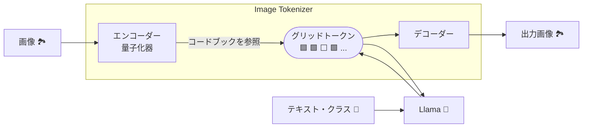

# LlamaGen: LlamaのNext-Token予測を使った画像生成

- Autoregressive Model Beats Diffusion: Llama for Scalable Image Generation
- [arXiv:2406.06525](https://arxiv.org/abs/2406.06525)

---

# はじめに

近年の画像生成AIは高品質な一方、大規模言語モデルとの統合は限定的。ChatGPTの画像生成はDALL-Eを呼び出すだけ。🤔

これはアーキテクチャの違いが原因。拡散モデルは高品質だが計算コストが高い。自己回帰モデルは高速だが、高解像度画像には不向き。

**LlamaGen** はLLMであるLlamaを自己回帰型画像生成に応用！画像をトークン化し、Llamaで予測生成することで高品質を実現。✨

将来は、図入り画像の前処理なし学習も可能になるかも？！

---
layout: image-left
image: https://cdn.bsky.app/img/avatar/plain/did:plc:et47te5fb7uv64pbltu37lcc/bafkreihfnrk5dlh43swtcstq7io6ox32z5jflucd6afirfpfm3j4zbvrnm@jpeg
---

# 自己紹介

* 名前: 小笠原寛明
* Bluesky: [@hiroga.bsky.social](https://bsky.app/profile/hiroga.bsky.social)
* Twitter: [@xhiroga](https://twitter.com/xhiroga)
* 所属: なし（2025年より社会人学生として大学院進学予定）

---

# ソースコード

LlamaGenはオープンソース！🎉
動かすのに苦労したので、フォークして`uv`で動くように整えたリポジトリを公開しました。💪

[FoundationVision/LlamaGen](https://github.com/FoundationVision/LlamaGen)

[xhiroga/LlamaGen](https://github.com/xhiroga/LlamaGen/tree/chore/uv)

---

# 関連研究

自己回帰モデルによる画像生成は、拡散モデル以前から存在していました。

* **PixelCNN (2016)**[^Oord_et_al_2016a][^Oord_et_al_2016b]: 自己回帰モデルによる画像生成の先駆け的な研究。
* **ImageGPT (2020)**[^Chen_et_al_2020]: Transformer を用いた自己回帰型画像生成モデル。画像を低解像度化し、ピクセルをトークンとして扱います。
* **ViT (2020)**[^Dosovitskiy_et_al_2020]: 画像をパッチに分割し、各パッチをトークンとして Transformer エンコーダーに入力します。画像分類タスクで高い性能を達成し、Transformer が画像認識にも有効であることを示しました。
* **DALL-E (2021)**[^Ramesh_et_al_2021]: Transformer を用いた画像生成モデル。画像を VAE で離散トークン化し、テキストと画像のペアデータで学習します。
* **VQGAN (2021)**[^Esser_et_al_2021]: ベクトル量子化を用いた Image Tokenizer と Transformer を用いた自己回帰型画像生成モデル。高解像度画像生成において、Transformer が CNN よりも優れた性能を持つことを示しました。
* **DiT (2023)**[^Peebles_and_Xie_2023]: 拡散モデルの一種で、ノイズ除去に Transformer を用います。拡散モデルと Transformer の利点を組み合わせることで、高品質な画像生成を実現しました。

[^Oord_et_al_2016a]: A. van den Oord, N. Kalchbrenner, and K. Kavukcuoglu, “Pixel Recurrent Neural Networks,” Aug. 19, 2016, arXiv: arXiv:1601.06759. Accessed: Nov. 28, 2024. [Online]. Available: http://arxiv.org/abs/1601.06759
[^Oord_et_al_2016b]: A. van den Oord, N. Kalchbrenner, O. Vinyals, L. Espeholt, A. Graves, and K. Kavukcuoglu, “Conditional Image Generation with PixelCNN Decoders,” Jun. 18, 2016, arXiv: arXiv:1606.05328. doi: 10.48550/arXiv.1606.05328.
[^Chen_et_al_2020]: M. Chen et al., “Generative Pretraining from Pixels,” 2020.
[^Dosovitskiy_et_al_2020]: A. Dosovitskiy et al., “An Image is Worth 16x16 Words: Transformers for Image Recognition at Scale,” Oct. 22, 2020, arXiv: arXiv:2010.11929. doi: 10.48550/arXiv.2010.11929.
[^Ramesh_et_al_2021]: A. Ramesh et al., “Zero-Shot Text-to-Image Generation,” Feb. 26, 2021, arXiv: arXiv:2102.12092. doi: 10.48550/arXiv.2102.12092.
[^Esser_et_al_2021]: P. Esser, R. Rombach, and B. Ommer, “Taming Transformers for High-Resolution Image Synthesis,” Jun. 23, 2021, arXiv: arXiv:2012.09841. doi: 10.48550/arXiv.2012.09841.
[^Peebles_and_Xie_2023]: W. Peebles and S. Xie, “Scalable Diffusion Models with Transformers,” Mar. 02, 2023, arXiv: arXiv:2212.09748. Accessed: Nov. 07, 2024. [Online]. Available: http://arxiv.org/abs/2212.09748

---

# LlamaGenの貢献

LlamaGenの貢献は、LLMのノウハウを画像生成に適用し、高品質を実現した点！

---

# LlamaGenのアーキテクチャ

2つの主要モジュール:

1. **Image Tokenizer:** 画像をトークン列に変換 (VQGANベース)
2. **Llama:** トークン列から自己回帰的に画像生成

---

# LlamaGen vs. ViT

どちらもTransformerを使うが、役割は違う！

| 特徴 | LlamaGen | ViT |
|---|---|---|
| タスク | 画像生成 | 画像分類 |
| アーキテクチャ | Transformer Decoder | Transformer Encoder |
| トークン化対象 | 画像パッチ | 画像パッチ |
| トークン化方法 | ベクトル量子化 | パッチ埋込み |

---

# Image Tokenizer 🔎

高解像度画像をトークン列に変換する重要モジュール。Transformerの計算コストを抑える🔑

* **エンコーダー:** 画像を低次元特徴マップに変換
* **量子化器:** 特徴マップをコードブックのベクトルに置き換え (トークン化)
* **デコーダー:** トークン列から画像を再構成

VQGANと同じアーキテクチャを採用。

---

# Image Tokenizer (VQGAN)

VQGANのアーキテクチャ。LlamaGenとほぼ同じで、自己回帰モデルがTransformerかLlamaかの違い。

---

# ベクトル量子化

連続ベクトル空間を離散コードブックで表現する手法。VQ-VAE等で利用され、高次元データを効率的に圧縮。

[分かりやすい記事](https://www.softech.co.jp/mm_120704_pc.htm)

---

# Image Tokenizer パラメータ

* **ダウンサンプル比:** 画像の解像度を下げる比率 (例: 8, 16)
* **コードブックの語彙数:** トークンの種類 (例: 4096, 32768)

256x256画像をダウンサンプル比8でトークン化 → 1024トークン

Llama3のボキャブラリーは128Kトークンなので、まだ桁が違う。

---

# Image Tokenizer 訓練

生成画像が入力画像に近づくよう、以下の損失関数を最小化:

$L_{AE} = L_2 (x, \widehat{x}) + L_P (x, \widehat{x}) + \lambda_G L_G (\widehat{x})$

* $L_2$: 平均二乗誤差
* $L_P$: 知覚的損失 (LPIPS)
* $L_G$: 敵対的損失 (PatchGAN)

---

# Next-Token予測による画像生成

Image Tokenizerで生成されたトークン列をLlamaに入力し、自己回帰的に次のトークンを予測。文章生成と同様のアプローチ。

PixelCNNやImageGPTも同様の手法だが、LlamaGenはLLMを使用することでスケーラビリティと生成品質を向上。

---

# CFG (Classifier-Free Guidance)

LlamaGenはStable Diffusion同様、CFGを用いて条件付き画像生成を実現。

テキスト条件付けでは、T5でテキストを埋め込みに変換し、画像トークン埋め込みと連結して入力に使用。

[CFG解説記事](https://cake-by-the-river.hatenablog.jp/entry/stable_diffusion_8)

---

# Next-Token予測の訓練

大規模言語モデルの事前学習と同様。予測トークンに対する交差エントロピー誤差を計算、逆伝播。

CFGでは、条件付き損失と条件なし損失を組み合わせて最終的な損失を計算。

---

# 評価指標

* **IS (Inception Score):** 生成画像の品質と多様性
* **FID (Fréchet Inception Distance):** 生成画像と実画像の分布の距離
* **rFID (Reconstruction FID):** Image Tokenizerの性能
* **sFID:** FIDの改良版
* **Precision/Recall:** 生成画像の多様性とプロンプト適合性
* **PSNR/SSIM:** 画質の客観的評価

---

# IS (Inception Score)

InceptionNetを用いて、生成画像の品質を評価。値が高いほど良い。

[IS解説記事](https://data-analytics.fun/2021/12/12/understanding-inception-score/)

---

# FID (Fréchet inception distance)

生成画像と実画像の分布の距離を測る。値が小さいほど良い。

---

# スケール則

LlamaGenもLLMと同様に、パラメータ数増加で高品質化。スケール則ばんざい！🙌

---

# LLMエコシステム🚀

LlamaGenはLLMの最適化技術(AdamW, 勾配クリッピング等)とvLLMによる高速推論を活用。

---

# まとめ

LlamaGenはLLMを自己回帰型画像生成に応用した新モデル。高品質なImage Tokenizerと効率的な訓練で拡散モデルに匹敵する品質を実現。LLMのスケール則にも従い、今後の発展に期待大！

---

# 今後の課題🤔

* トークン数の制御
* マルチモーダルへの拡張

これらの課題解決で、LlamaGenは更なる進化を遂げるでしょう！

---

# Q&A

ご清聴ありがとうございました！
質問等あればお気軽にどうぞ！🙋‍♀️
